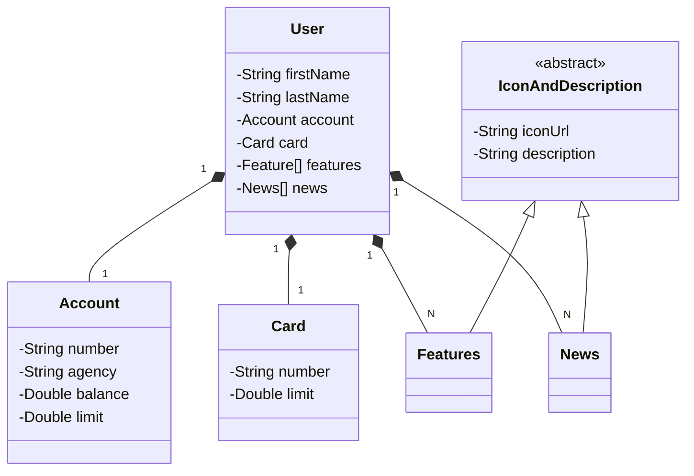

# DIO - RESTful API - Spring Boot 3

Exemplo de API RESTful utilizando Java 17 e Spring Boot 3

## Diagrama de Classes



---

## Tecnologias Utilizadas

- **Java 17**
- **Spring Boot 3**
  - Spring Web
  - Spring Data JPA
  - H2 Database
  - Lombok
  - Springdoc OpenAPI

---

## Como Executar

1. Clone o repositório:

   ```bash
   git clone https://github.com/correa-coder/dio-springboot-3.git
   ```

2. Navege até o repositório do projeto:

   ```bash
   cd dio-springboot-3
   ```

3. Execute o projeto usando Gradle:

   **Linux**

   ```bash
   # Linux
   ./gradlew bootRun

   # Windows
   gradlew.bat
   ```

---

## Documentação da API

A documentação da API pode ser acessada através do endpoint `localhost:8080/swagger-ui.html` após iniciar a aplicação.

---

## Licença

Este projeto está licenciado sobre a licença MIT. Veja o arquivo `LICENCE` para mais detalhes.
