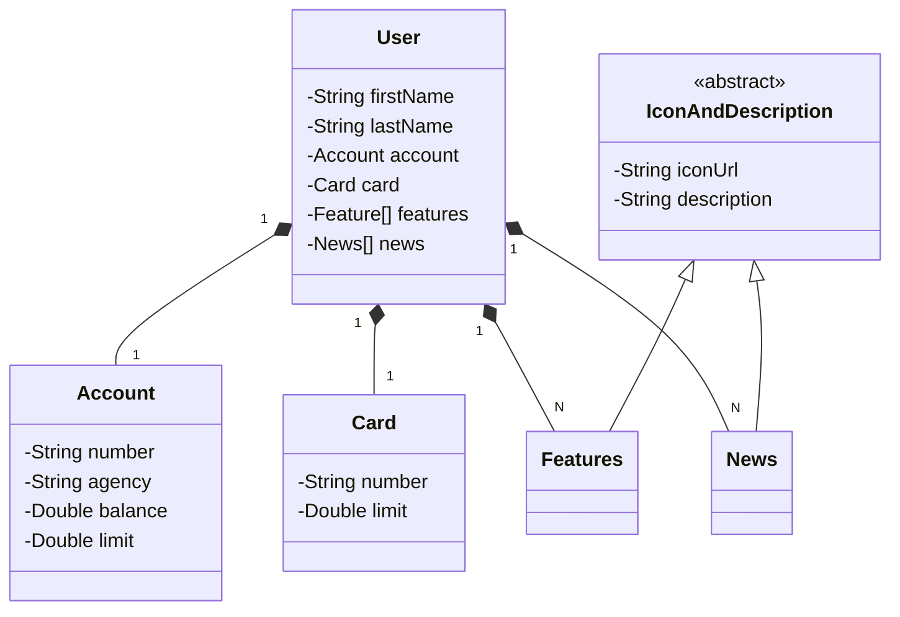

# DIO - RESTful API - Spring Boot 3

Exemplo de API RESTful utilizando Java 17 e Spring Boot 3

## Diagrama de Classes

```mermaid
classDiagram
  class User {
    -String firstName
    -String lastName
    -Account account
    -Card card
    -Feature[] features
    -News[] news
  }

  class Account {
    -String number
    -String agency
    -Double balance
    -Double limit
  }

  class Card {
    -String number
    -Double limit
  }

  class IconAndDescription {
    <<abstract>>
    -String iconUrl
    -String description
  }

  User "1" *-- "1" Account
  User "1" *-- "1" Card
  User "1" *-- "N" Features
  User "1" *-- "N" News
  IconAndDescription <|-- Features
  IconAndDescription <|-- News
```
